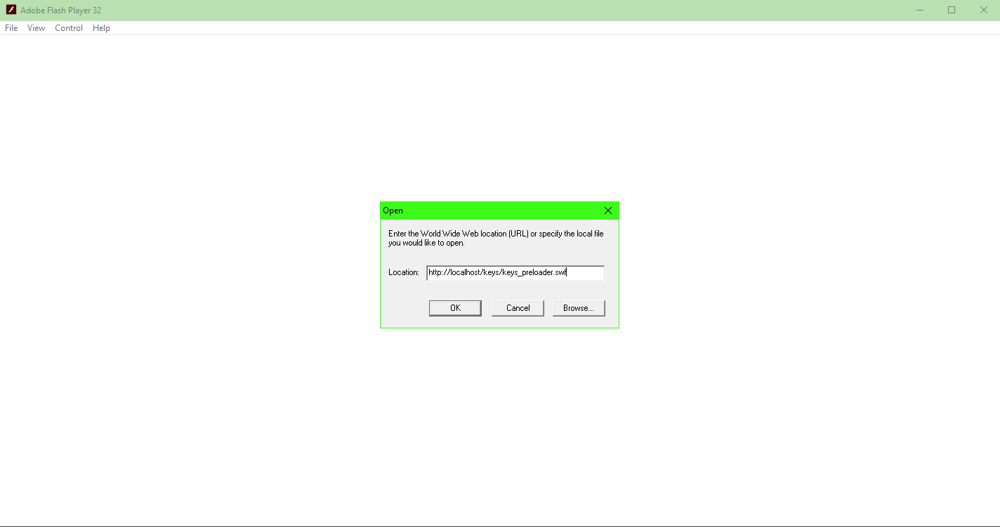

# DWMI server
An (incomplete) emulation of the server(s) that ran the DWMI games.

There are two main parts: 
* The Gateway = actually needed for the game to run
* SOS = some fun debug output

Vortex Run, Match and Escape the Silence don't need the server.

I have included one (1) modded swf, all others are the original ones, pulled from the web archive.

The modded swf is the_keys_of_time_debug_editormaybe.swf, it allows you to edit the levels for keys. It is a little buggy though.

If you are hosting the server locally, you should open a game like so:

Do not just double-click the swiffs.

A side effect of this is that keys will never load into dev mode (which allows cheats and to load custom levels). A modded swf is needed for this.

I worked on this, mainly because of jslev. If you want to run the games locally, without the server (or if you want dev mode), you should check out [this page on Archive.org](https://archive.org/details/doctorwhomonsterinvasionflash). (NOTE: These are modded swfs)
